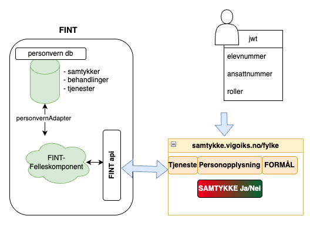

# fint-samtykke-service-backend

## Beskrivelse
Løsningen gjør det mulig å legge til behandlinger som brukerene kan gi eller trekke samtykke til. Denne løsningen
benytter seg av api'ene til FINT-felleskomponent.

## Systemoversikt
Løsningen består av en frontend og en backend. Eleven eller den ansatte logger inn i løsningen vha federert pålogging 
fra sin egen O365 tenant. Under påloggingen leses elevenummer eller ansattnummer fra jwt tokenet, samt de rollene som 
brukeren har. 

Utifra opplysningene fra påloggingen vil informasjon om brukeren bli hentet fra FINT med de samtykkebehandlinger og
status for disse behandlingene som er lagret. Første gangen en bruker logger inn blir det generert opp et tomt samtykke 
for de behandlinger som er lagret. Velger brukeren å gi samtykke til behandlingen lagrest det ett nytt samtykke i 
databasen. Velger brukeren å ikke gi samtykke vil det tomme samtykket forbli uendret mao samtykke ikke gitt.

](docs/images/systemOversikt.png)

## api
Løsningen benytter seg av følgende FINT-api'er

baseUri: https://\<miljø\>.felleskomponent.no/
- administrasjon/personal/personalressurs/
- administrasjon/personal/person/
- utdanning/elev/elev/
- utdanning/elev/person/
- personvern/samtykke/samtykke/
- personvern/samtykke/tjeneste/
- personvern/samtykke/behandling/
- personvern/kodeverk/behandlingsgrunnlag
- personvern/kodeverk/personopplysning/

## database
Databasen er ikke en del av samtykketjenesten, men er en del av FINT-felleskomponent. Tjenesten kommuniserer med databsen
via FINT api'ene og ett eget personvernadapter. Databasen lagrer tjenester, behandlinger og samtykker.

### tabell behandling
| Felt               | Type         | Nullable |
|--------------------|--------------|----------|
| id                 | varchar(255) | No       |
| last_modified_date | timestamp    | Yes      |
| org_id             | varchar(255) | Yes      |
| resource           | json         | Yes      |

### tabell samtykke
| Felt               | Type         | Nullable |
|--------------------|--------------|----------|
| id                 | varchar(255) | No       |
| last_modified_date | timestamp    | Yes      |
| org_id             | varchar(255) | Yes      |
| resource           | json         | Yes      |

### tabell tjeneste
| Felt               | Type         | Nullable |
|--------------------|--------------|----------|
| id                 | varchar(255) | No       |
| last_modified_date | timestamp    | Yes      |
| org_id             | varchar(255) | Yes      |
| resource           | json         | Yes      |

**resource** feltene er json-objecter som samsvarer med informasjonsmodellen i FINT.
- https://informasjonsmodell.felleskomponent.no/docs/samtykke_behandling?v=v4.0.10
- https://informasjonsmodell.felleskomponent.no/docs/samtykke_tjeneste?v=v4.0.10
- https://informasjonsmodell.felleskomponent.no/docs/samtykke_samtykke?v=v4.0.10